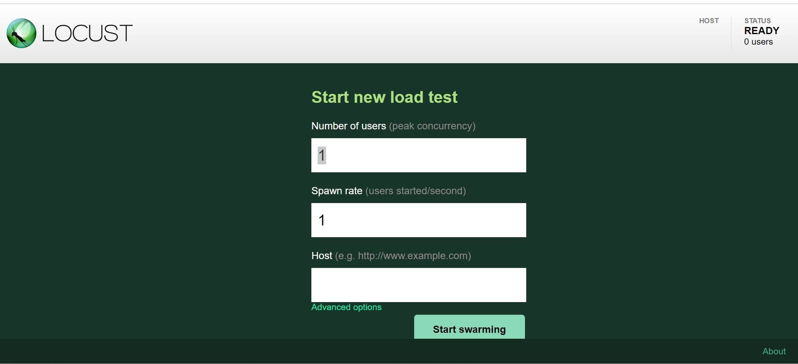
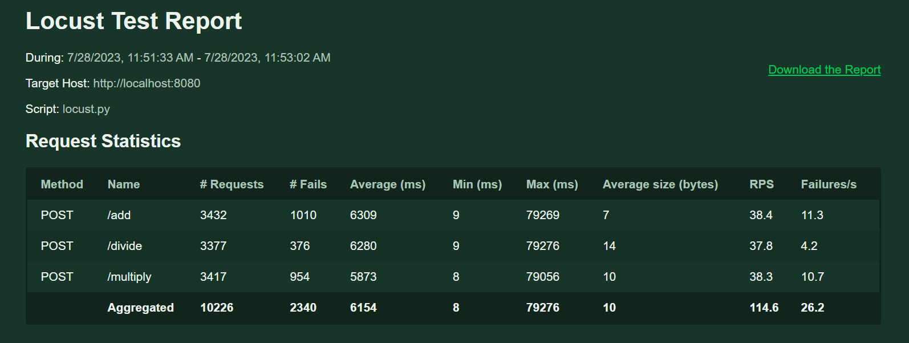
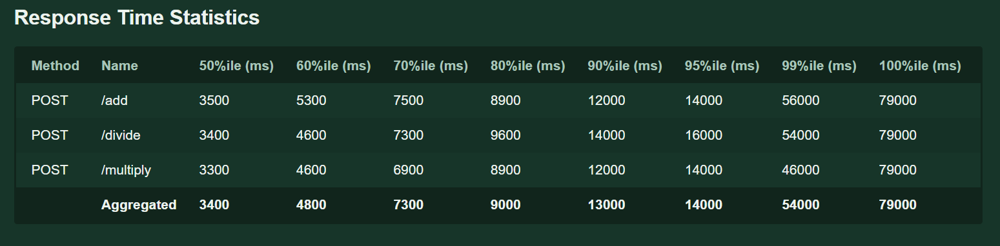
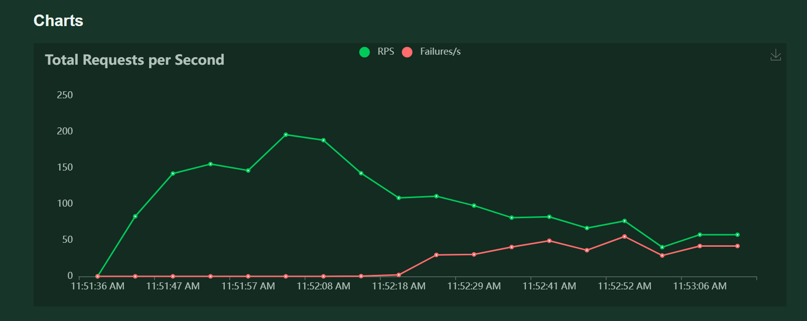
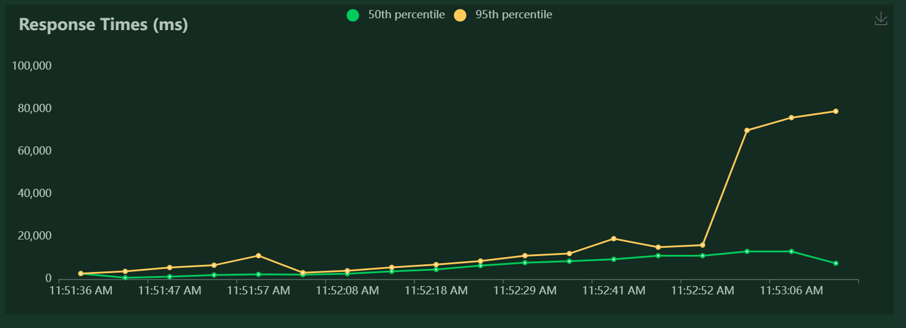

# Load testing and Benchmarking analysis

we used `locust` and scripts written in `python` to condcut load testing on our project.

## How to use 

First, navigate to `api-gateway\Locust` and edit the `locust.py` file to customise the test you want to do. 

After editing your code, in the same directory, run the command in terminal;

```shell
    locust -f locust.py 
```

Next, open any web browsing application and enter `http://localhost:8089/` in the search bar. 

You will be brought to this page where you can enter the amount of users, the spawn rate and the HTTP server that you would like to conduct your load testing on. 



Now you can test your HTTP servers!!

## Load balancing and Benchmarking analysis

### Test conditions 
1. 3 microservices each with 15 servers with rate limiting of 2000 connections and 2000 query per second
2. 1000 users with 100 spawn rate

Results as shown;

| Metric                                         | Value       |
| ---------------------------------------------- | ----------- |
| Max number of requests before server error     | 3400        |
| Average response time with 15 servers (50%ile) | 3400 ms     |







