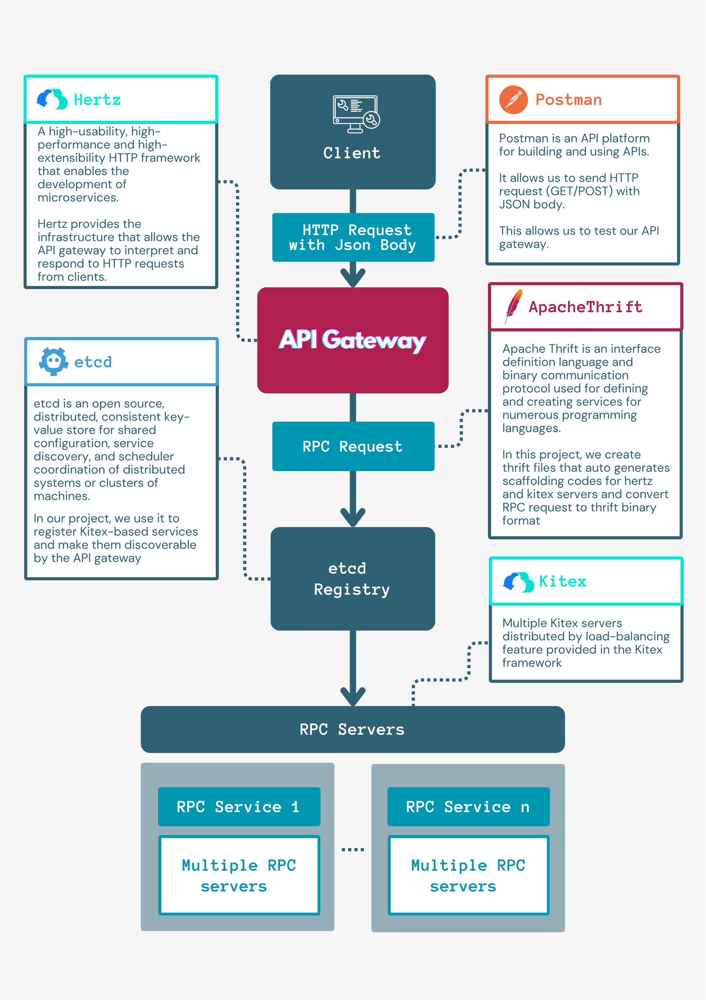
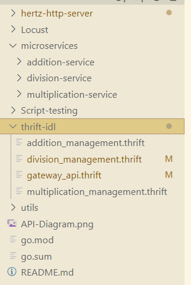

# CloudWeGo API Gateway

An API Gateway written in `GO` that uses CloudWeGo `Kitex` and `Hertz` frameworks to develop an API Gateway that accepts `HTTP` requests encoded in `JSON` format, Utilising the Generic-Call feature of `Kitex` to translate these requests into `Thrift` binary format requests. The API Gateway will then proceed to forward the translated requests to one of the backend `RPC` servers obtained from the registry centre. 

## Tech Design

[Tech Design Link](https://array-api-gateway.notion.site/Project-README-Milestone-3-c7df8b1dfe444b1c98e0cc0a2b53c55c) 

## API Gateway Design Diagram


## How it works

1. Client sends HTTP request with a JSON body with a "FirstNum" and "SecondNum" attribute. <br>
2. Hertz server processes the request and sends it to the Kitex Servers. <br>
3. A generic Kitex server will be generated and registered in the `etcd` registry. <br>
4. Kitex server will process the request and convert it into `Thrift Binary Format` before sending it to the RPC servers. <br>
5. The RPC servers will process the `addition` request and returns the response. <br>
6. The API gateway will process and encode the response as an HTTP Response.

## Testing
1. For load testing and benchmarking analysis, please refer to [Locust-ReadMe](Locust)
2. For unit testing, please refer to [Script-testing-ReadMe](Script-testing)

## Installation

Before running the project, make sure you install the following, <br>
- [Hertz](https://www.cloudwego.io/docs/hertz/getting-started/)<br>
- [Kitex](https://www.cloudwego.io/docs/kitex/getting-started/)<br>
- [etcd](https://etcd.io/docs/v3.2/install/)<br>
- [PostMan](https://www.postman.com/downloads/)<br>
- [Python](https://www.python.org/downloads/)<br>
- [Locust](https://docs.locust.io/en/stable/installation.html)

## Instructions to run the API Gateway

You can follow the instructions below or view this instructional [video](https://drive.google.com/file/d/11TkbHvjIoSWAt_u-J9h3dy4Ev9bdOI9R/view?usp=drive_link)

Make sure `etcd` is running.

- Instructions [here](https://etcd.io/docs/v3.5/quickstart/) for `Mac` users. If your machine is running on `Windows`, unzip the folder and run the `etcd` application in the folder.

In the `hertz-http-server` directory, run `go run .` in the terminal.

In the `addition-service` directory, run `go run .` in the terminal.

Test with `Postman` using the following command: `http://127.0.0.1:8080/add` with the JSON body of:

```json
{
  "FirstNum" : "1",
  "SecondNum" : "2"
}
```

Anticipate a response of:

```json
{
  "Sum": "3"
}
```

## Creating a new Divison microservice and integrating it on the API Gateway

- The `hertz-http-server` folder contains the code for accepting `HTTP` requests and the primary business code for the API gateway implementation.

- The `utils` folder contains the file `utils.go`, which offers a number of useful functions to assist developers with using our API gateway.

- The `thrift-idl` folder contains thrift Interface Definition Language files. These files are used to generate the infrastructure code for the `Hertz` `HTTP` server as well as any microservices that are developed.

- The `addition-service` and `multiplication-service` folders contain the code for addition and multiplication RPC servers i.e. addition and multiplication microservices.<br>
These are not part of the gateway itself and are more like examples of how you can use it. Now we will be implementing a third service - `division-service` - to show how easy it is to build a new microservice and add it to integrate it with existing microservice infrastructure using our API gateway.

- Before following the steps below, clone our repository onto your local computer and make sure you are in the root directory (with the `go.mod` file)


## Creating a new RPC server (Division Service)

Create an `IDL` file e.g.<br>
- Ensure that you follow these [standards](https://www.cloudwego.io/docs/kitex/tutorials/advanced-feature/generic-call/thrift_idl_annotation_standards/).

Navigate to `api-gateway\thrift-idl` folder and create a file called `division_management.thrift` and input the following code. 

```thrift
// tells thrift to generate scaffolding code in ‘Go’ in the   subdirectory kitex_gen/division/api
namespace go division.management// directories generated will be named following this convention

// creates a new struct ‘Division request’ with the above implementation
struct DivisionRequest {
1: required string FirstNum;
2: required string SecondNum;
} 

// creates a new struct ‘Division Response’ with the above implementation
struct DivisionResponse {
1: string Quotient;
} 

// Defines the service name and the method signature of the divideNumbers method offerred by the service
service DivisionManagement {
DivisionResponse divideNumbers(1: DivisionRequest req);
} 
```
Next, navigate to `microservice` directory and create a **folder** called `division-service`. At this point, your directory should look like this;



Navigate into the `api-gateway\microservices\division-service` and run the followng command in the terminal

```shell
kitex -module github.com/ararchch/api-gateway -service Division ../../thrift-idl/division_management.thrift

```

Update your logic in `handler.go` in the `division-service` folder with the following code;

```go
package main

import (
	"context"
	"fmt"
	"strconv"

	management "github.com/ararchch/api-gateway/microservices/division-service/kitex_gen/division/management"
)

// DivisionManagementImpl implements the last service interface defined in the IDL.
type DivisionManagementImpl struct{}

// DivideNumbers implements the DivisionManagementImpl interface.
func (s *DivisionManagementImpl) DivideNumbers(ctx context.Context, req *management.DivisionRequest) (resp *management.DivisionResponse, err error) {
	
	// parse int from string of First Number
	firstNumInt, err := strconv.Atoi(req.FirstNum)
	if err != nil {
		panic(err)
	}

	// parse int from string of Second Number
	secondNumInt, err := strconv.Atoi(req.SecondNum)
	if err != nil {
		panic(err)
	}

	// divide two numbers 
	finalQuotient := firstNumInt / secondNumInt;

	// convert finalSum to string and return response of type DivisionResponse and error = nil
	return &management.DivisionResponse{
		Quotient: fmt.Sprintf("%d", finalQuotient),
	}, nil

}
```

Navigate to `main.go` in the `division-service` folder, and add the following code;<br>
Note that the RateLimit option is optional and up to your discretion.

```go
package main

import (
	api "github.com/ararchch/api-gateway/microservices/division-service/kitex_gen/division/api/divisionmanagement"
	"github.com/ararchch/api-gateway/utils"
)

func main() {

	servers := utils.CreateMultipleServers(
		3, // Number of servers you want to create to handle requests made to this microservice
		"Division", // name of microservice (servers will be registered under this name)
		new(DivisionManagementImpl), // the handler file that you defined in the previous step
		api.NewServiceInfo(), // serviceInfo file containing generated details unique to your microservice
		utils.RateLimit(1000, 1000), // optional rate limit if you wish to include it
	)

	utils.RunServers(servers) // runs all servers simultaneously
}
```
### Integrating Service into API Gateway

Navigate to `api-gateway\thrift-idl` and open the `gateway_api.thrift` and add the following code;

```go
namespace go api

struct AdditionRequest {
1: required string FirstNum (api.body="FirstNum");
2: required string SecondNum (api.body="SecondNum")
}

struct AdditionResponse {
1: string Sum;
}

struct MultiplicationRequest {
1: required string FirstNum (api.body="FirstNum");
2: required string SecondNum (api.body="SecondNum")
}

struct MultiplicationResponse {
1: string Product;
}

// request structure that the user sends to the gateway
struct DivisionRequest { 
1: required string FirstNum (api.body="FirstNum");
2: required string SecondNum (api.body="SecondNum")
}

// response structure sent by gateway to the user
struct DivisionResponse {
1: string Quotient;
}

service Gateway {
AdditionResponse addNumbers(1: AdditionRequest req) (api.post="/add");
MultiplicationResponse multiplyNumbers(1: MultiplicationRequest req) (api.post="/multiply");
DivisionResponse divideNumbers(1: DivisionRequest req) (api.post="/divide"); // endpoint and method details
}
```

Navigate into `hertz-http-request` and run in the terminal;

```shell
hz update -idl ../thrift-idl/gateway_api.thrift
```

Navigate to `hertz-http-request/biz/handler/api/gateway.go`

Implement `DivideNumbers` method in the file as follows; 

```go
// Code generated by hertz generator.

package api

import (
	"context"

	additionService "github.com/ararchch/api-gateway/microservices/addition-service/kitex_gen/addition/management"
	divisionService "github.com/ararchch/api-gateway/microservices/division-service/kitex_gen/division/management"
	api "github.com/ararchch/api-gateway/hertz-http-server/biz/model/api"
	multiplicationService "github.com/ararchch/api-gateway/microservices/multiplication-service/kitex_gen/multiplication/management"
	"github.com/ararchch/api-gateway/utils"
	"github.com/cloudwego/hertz/pkg/app"
	"github.com/cloudwego/hertz/pkg/protocol/consts"
)

// AddNumbers .
// @router /add [POST]
func AddNumbers(ctx context.Context, c *app.RequestContext) {

	// inital declarations (pre-generated)
	var err error
	var req api.AdditionRequest

	// bind error params to req (pre-generated)
	err = c.BindAndValidate(&req)
	if err != nil {
		c.String(consts.StatusBadRequest, err.Error())
		return
	}

	// create new client (with loadbalancing, service discovery capabilities) using utils.GenerateClient feature
	additionClient, err := utils.GenerateClient("Addition", utils.RpcTimeout(3000), utils.ConnectionTimeout(500))
	if err != nil {
		panic(err)
	}

	// binding req params to RPC reqest struct (following the request format declared in RPC service IDL)
	reqRpc := &additionService.AdditionRequest{
		FirstNum:  req.FirstNum,
		SecondNum: req.SecondNum,
	}

	// initate new RPC response struct (as declared in RPC service IDL). This response variable will be populated by MakeRpcRequst function
	var respRpc additionService.AdditionResponse

	// calling MakeRpcRequest method declared in the utils package
	err = utils.MakeRpcRequest(ctx, additionClient, "addNumbers", reqRpc, &respRpc)
	if err != nil {
		panic(err)
	}

	// initating and repackaging RPC response into new HTTP AdditionResponse
	resp := &api.AdditionResponse{
		Sum: respRpc.Sum,
	}

	// return to client as JSON HTTP response
	c.JSON(consts.StatusOK, resp)
}

// MultiplyNumbers .
// @router /multiply [POST]
func MultiplyNumbers(ctx context.Context, c *app.RequestContext) {
	var err error
	var req api.MultiplicationRequest
	err = c.BindAndValidate(&req)
	if err != nil {
		c.String(consts.StatusBadRequest, err.Error())
		return
	}

	// create new client (with loadbalancing, service discovery capabilities) using utils.GenerateClient feature
	multiplicationClient, err := utils.GenerateClient("Multiplication", utils.RpcTimeout(3000), utils.ConnectionTimeout(500))
	if err != nil {
		panic(err)
	}

	// binding req params to RPC reqest struct (following the request format declared in RPC service IDL)
	reqRpc := &multiplicationService.MultiplicationRequest{
		FirstNum:  req.FirstNum,
		SecondNum: req.SecondNum,
	}

	// initate new RPC response struct (as declared in RPC service IDL). This response variable will be populated by MakeRpcRequst function
	var respRpc multiplicationService.MultiplicationResponse

	// calling MakeRpcRequest method declared in the utils package
	err = utils.MakeRpcRequest(ctx, multiplicationClient, "multiplyNumbers", reqRpc, &respRpc)
	if err != nil {
		panic(err)
	}

	// initating and repackaging RPC response into new HTTP AdditionResponse
	resp := &api.MultiplicationResponse{
		Product: respRpc.Product,
	}

	// return to client as JSON HTTP response
	c.JSON(consts.StatusOK, resp)
}

// DivideNumbers .
// @router /divide [POST]
func DivideNumbers(ctx context.Context, c *app.RequestContext) {
	var err error
	var req api.DivisionRequest
	err = c.BindAndValidate(&req)
	if err != nil {
		c.String(consts.StatusBadRequest, err.Error())
		return
	}

	// create new client (with loadbalancing, service discovery capabilities) using utils.GenerateClient feature
	divisionClient, err := utils.GenerateClient("Division", utils.RpcTimeout(3000), utils.ConnectionTimeout(500))
	if err != nil {
		panic(err)
	}

	// binding req params to RPC reqest struct (following the request format declared in RPC service IDL)
	reqRpc := &divisionService.DivisionRequest{
		FirstNum:  req.FirstNum,
		SecondNum: req.SecondNum,
	}

	var respRpc api.DivisionResponse

	// calling MakeRpcRequestWithRetry method declared in the utils package
	err = utils.MakeRpcRequestWithRetry(ctx, divisionClient, "divideNumbers", reqRpc, &respRpc, 3)
	if err != nil {
		panic(err)
	}

	resp := &api.DivisionResponse{
		Quotient: respRpc.Quotient,
	}

	// return to client as JSON HTTP response
	c.JSON(consts.StatusOK, resp)
}

// MultiplyNumbers .
// @router /multiply [POST]
func MultiplyNumbers(ctx context.Context, c *app.RequestContext) {
	var err error
	var req api.MultiplicationRequest
	err = c.BindAndValidate(&req)
	if err != nil {
		c.String(consts.StatusBadRequest, err.Error())
		return
	}

	// create new client (with loadbalancing, service discovery capabilities) using utils.GenerateClient feature
	multiplicationClient, err := utils.GenerateClient("Multiplication", utils.RpcTimeout(3000), utils.ConnectionTimeout(500))
	if err != nil {
		panic(err)
	}

	// binding req params to RPC reqest struct (following the request format declared in RPC service IDL)
	reqRpc := &multiplicationService.MultiplicationRequest{
		FirstNum:  req.FirstNum,
		SecondNum: req.SecondNum,
	}

	// initate new RPC response struct (as declared in RPC service IDL). This response variable will be populated by MakeRpcRequst function
	var respRpc multiplicationService.MultiplicationResponse

	// calling MakeRpcRequest method declared in the utils package
	err = utils.MakeRpcRequest(ctx, multiplicationClient, "multiplyNumbers", reqRpc, &respRpc)
	if err != nil {
		panic(err)
	}

	// initating and repackaging RPC response into new HTTP AdditionResponse
	resp := &api.MultiplicationResponse{
		Product: respRpc.Product,
	}

	// return to client as JSON HTTP response
	c.JSON(consts.StatusOK, resp)
}

// DivideNumbers .
// @router /divide [POST]
func DivideNumbers(ctx context.Context, c *app.RequestContext) {
	var err error
	var req api.DivisionRequest
	err = c.BindAndValidate(&req)
	if err != nil {
		c.String(consts.StatusBadRequest, err.Error())
		return
	}

	// create new client (with loadbalancing, service discovery capabilities) using utils.GenerateClient feature
	divisionClient, err := utils.GenerateClient("Division", utils.RpcTimeout(3000), utils.ConnectionTimeout(500))
	if err != nil {
		panic(err)
	}

	// binding req params to RPC reqest struct (following the request format declared in RPC service IDL)
	reqRpc := &divisionService.DivisionRequest{
		FirstNum:  req.FirstNum,
		SecondNum: req.SecondNum,
	}

	var respRpc api.DivisionResponse

	// calling MakeRpcRequestWithRetry method declared in the utils package
	err = utils.MakeRpcRequestWithRetry(ctx, divisionClient, "divideNumbers", reqRpc, &respRpc, 3)
	if err != nil {
		panic(err)
	}

	resp := &api.DivisionResponse{
		Quotient: respRpc.Quotient,
	}

	// return to client as JSON HTTP response
	c.JSON(consts.StatusOK, resp)
}
```

Now you are done with editing the API Gateway! Thank you! **:)**
