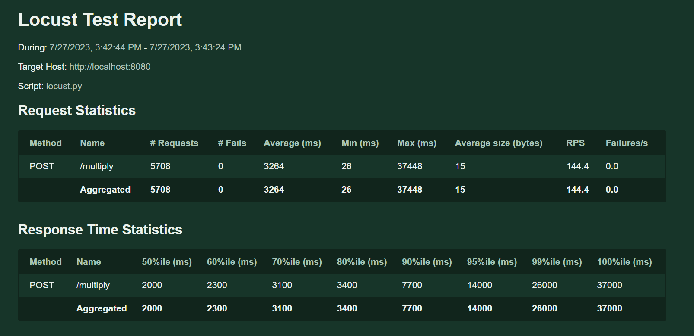

# Unit testing and System testing 

Unit testing is done via creating multiple scripts in `Go`, `Postman` and `locust`.

## Accepting HTTP request 

This test was to check if the Hertz HTTP Server was up and running and capable of responding to HTTP requests. Test script was written in javascript and tested via postman. 

Test was get requests sent to `http://127.0.0.1:8080/ping` endpoint after running the http server.

```javascript
// Test for response "message": "pong" 100 times
for (let i = 0; i < 100; i++) {
    pm.test(`Test ${i + 1}: Response message is 'pong'`, function () {
        pm.expect(pm.response.json().message).to.equal('pong');
    });
}
```

All 100 tests passed indicating that HTTP server was running and able to respond to requests. 

See image below for test results


## Load Balancing

The nature of this feature means the best way to test it would be to run the gateway with load balancing, and then without, and compare statistics. 

1. We used a testing tool called `locust` to help us with this. Locust creates a `swarm` of users that spam the selected endpoint(s) with queries and then presents statistics of the tests. 
2. Details of test:
    1. We created 15 multiplication servers Rate Limited to 2000 connections and 200 QPS
    2. Test was ran with 5000 users with 1000 spawn rate
    3. We tested for the average response rate with/without the load balancer in place 
3. Results:

Test with load balancer




Test without load balancer


As can be observed, the average response time without the load balancer is significantly larger vs with the load balancer in place (the 50%ile response time being 4000ms without the load balancer vs 2000ms with it). 

Additionally, there were multiple errors that were thrown. The first error was due to the rate limiting, the second and third error is due to the overloading of 1 server. Both were caused due to inefficient distribution of load. Altogether, this proves that our load balancing implementation is working.

## Retry and timeout

For context, the division service method was set up in the gateway.go file as below

```Go
// initating the client
divisionClient, err := utils.GenerateClient("Division", utils.RpcTimeout(3000), utils.ConnectionTimeout(500))
	if err != nil {
		panic(err)
	}
[...]

// making the Rpc request with 3 retries
err = utils.MakeRpcRequestWithRetry(ctx, divisionClient, "divideNumbers", reqRpc, &respRpc, 3)
	if err != nil {
		panic(err)
	}
```

**Retry**: To test the retry feature, we had to simulate a failure. As such we did not run the division service server to force the RPC call to fail. As expected, the following was printed in the terminal window:

```shell
------> Retrying.... 0
------> Retrying.... 1
------> Retrying.... 2
------> Retrying.... 3
Failed despite 3 retries
```

**Timeout**

1. **To simulate a RPC timeout,**the `time.Sleep(5 * time.Second)` command was inserted into the division service’s `DivideNumbers` method. This would cause the RPC response to take longer than the 3000ms or 3s RPC timeout. As expected the request timed out with the terminal showing the following error `err=rpc timeout: timeout=3s, to=Division, method=divideNumbers,...` This indicates that the RPC timeout feature works.
2.  **The connection timeout** feature was tested similar to the **Retry** feature. Although isolating it was difficult as not running the division server meant that the service itself was not registered in the service registry, which returned a service discovery error. As such, we were unable to isolate it, however. this is a fairly thin feature built on top of the existing Kitex framework implementation, and so it is likely to work. In addition, it would be tested as part of full system tests anyways.

## Rate limiting 

### Test for max connections 
1. Conducted on the multiplication service, with the following option enabled `utils.RateLimit(1000, 1000),` Max connections is the first argument of the method, so in this case was set to 1000.  
2. Test was ran on only 1 multiplication server with the setting above. 
3. Ran with 2000 users with 200 spawn rate 
4. The result is as shown


After 1000 requests are made, all additional requests are observed to be failures. The error message is [Error] KITEX: OnRead Error: request over limit: request too frequent. Proving that max-connections setting within rate limit is working. 

### Test for QPS
1. Conducted on the multiplication service, with the following option enabled `utils.RateLimit(2000, 10),` max QPS is the second argument of the method, so in this case was set to 10.  
2. Test was ran on only 1 multiplication server with the setting above. 
3. Ran with 100 users with 10 spawn rate 
4. The result is as shown


The test achieved 65.9 Request per second (or QPS) and 57.7 of them failed per second, which is approximately the amount that we expect to fail based on our rate limiter. 

The error message returned for failed requests is `[Error] KITEX: OnRead Error: request over limit: request too frequent` Proving that rate limiting is working.

## System Testing 

System testing is done using the same `Go` scripts. Only this time, all endpoints are tested at the same time. The script is as shown;

```Go
package main

import (
	"encoding/json"
	"io/ioutil"
	"net/http"
	"strings"
	"testing"
)

type Response struct {
	Product string `json:"Product"`
	Quotient string `json:"Quotient"`
    Sum string `json:"Sum"`
}

func TestMultiplyEndpoint(t *testing.T) {
	testEndpoint(t, "http://127.0.0.1:8080/multiply", "18", "multiply")
}

func TestDivideEndpoint(t *testing.T) {
	testEndpoint(t, "http://127.0.0.1:8080/divide", "2", "divide")
}

func TestAddEndpoint(t *testing.T) {
	testEndpoint(t, "http://127.0.0.1:8080/add", "9", "add")
}

func testEndpoint(t *testing.T, url string, expectedProduct string, operation string) {
	method := "POST"
	payload := strings.NewReader(`{ "FirstNum": "6", "SecondNum": "3" }`)

	client := &http.Client{}
	req, _ := http.NewRequest(method, url, payload)
	req.Header.Add("Content-Type", "application/json")

	res, err := client.Do(req)
	if err != nil {
		t.Fatalf("Failed to send request: %v", err)
	}

	body, err := ioutil.ReadAll(res.Body)
	if err != nil {
		t.Fatalf("Failed to read response body: %v", err)
	}

	var resp Response
	err = json.Unmarshal(body, &resp)
	if err != nil {
		t.Fatalf("Failed to unmarshal response body: %v", err)
	}

	var result string
    if operation == "multiply" {
        result = resp.Product
    } else if operation == "divide" {
        result = resp.Quotient
    } else if operation == "add" {
        result = resp.Sum
    }

	if result != expectedProduct {
		t.Fatalf("Expected '%v', got '%v'", expectedProduct, resp.Product)
	}
}
```


